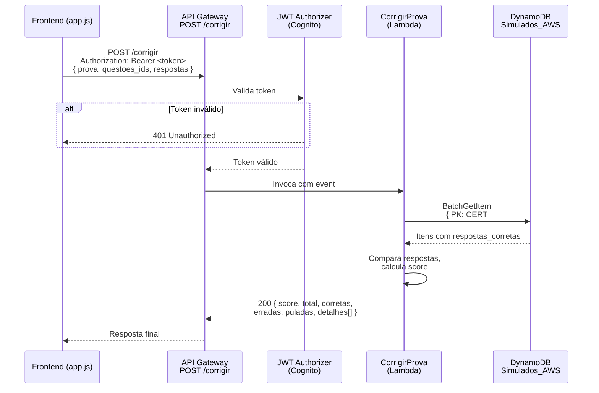
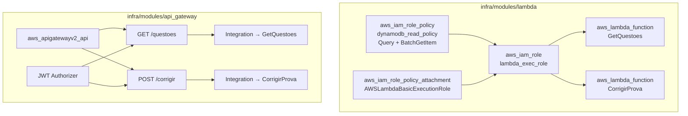

# Design Document — Passo 2: Motor de Correção no Backend (POST /corrigir)

## Overview

Este documento descreve a arquitetura e implementação do motor de correção de provas no backend. A mudança central é mover a lógica de comparação de respostas do frontend para uma nova função Lambda (`CorrigirProva`), exposta via `POST /corrigir` no API Gateway existente, protegida pelo mesmo JWT Authorizer do Cognito já configurado no Passo 1.

Simultaneamente, a Lambda `GetQuestoes` é atualizada para remover o campo `respostas_corretas` do retorno, garantindo que o gabarito nunca trafegue para o cliente. A infraestrutura Terraform é expandida no módulo `lambda` e no módulo `api_gateway` sem alterar a estrutura modular existente.

## Architecture





## Components and Interfaces

### 1. Lambda CorrigirProva (`backend/corrigir/lambda_function.py`)

**Interface de entrada** (HTTP POST body):
```json
{
  "prova": "SAA-C03",
  "questoes_ids": ["SAA-C03#001", "SAA-C03#002", "SAA-C03#003"],
  "respostas": {
    "0": 1,
    "1": [0, 2],
    "2": 0
  }
}
```

- `prova`: código da certificação (string, obrigatório)
- `questoes_ids`: lista ordenada de SKs das questões exibidas (array de strings)
- `respostas`: mapa de índice da questão (string) → resposta do usuário (int ou lista de int); questões ausentes são tratadas como puladas

**Interface de saída** (HTTP 200):
```json
{
  "score": 67,
  "total": 3,
  "corretas": 2,
  "erradas": 1,
  "puladas": 0,
  "detalhes": [
    {
      "id": "SAA-C03#001",
      "status": "correta",
      "resposta_usuario": [1],
      "resposta_correta": [1],
      "explicacao": "Explicação detalhada..."
    },
    {
      "id": "SAA-C03#002",
      "status": "errada",
      "resposta_usuario": [0, 2],
      "resposta_correta": [1, 3],
      "explicacao": "Explicação detalhada..."
    }
  ]
}
```

**Fluxo interno:**
1. Captura body: `json.loads(event.get('body') or '{}')`
2. Monta as chaves para `BatchGetItem`: `[{"PK": "CERT#<prova>", "SK": sk} for sk in questoes_ids]`
3. Executa `BatchGetItem` (máximo 100 itens por chamada; a lista de questões por simulado é sempre ≤ 65)
4. Indexa os itens retornados por SK para acesso O(1)
5. Itera sobre `questoes_ids` por índice, compara respostas, acumula contagens e monta `detalhes`
6. Serializa resposta com `DecimalEncoder`

### 2. Lambda GetQuestoes — modificação (`backend/get_questoes/lambda_function.py`)

Única mudança: remover `respostas_corretas` de cada item antes de serializar.

```python
# Antes de retornar:
for questao in questoes:
    questao.pop('respostas_corretas', None)
```

### 3. Módulo Terraform Lambda (`infra/modules/lambda/`)

**`main.tf`** — adições:
- `data "archive_file" "lambda_corrigir_zip"` — empacota `backend/corrigir/`
- `aws_lambda_function "corrigir_prova"` — reutiliza `aws_iam_role.lambda_exec_role.arn`
- Atualização de `aws_iam_role_policy "dynamodb_read_policy"` — adiciona `dynamodb:BatchGetItem`

**`outputs.tf`** — adições:
- `lambda_corrigir_invoke_arn`
- `lambda_corrigir_function_name`

**`variables.tf`** — sem mudanças (a variável `dynamodb_table_arn` já existe e é suficiente)

### 4. Módulo Terraform API Gateway (`infra/modules/api_gateway/`)

**`variables.tf`** — adições:
- `lambda_corrigir_invoke_arn` (string)
- `lambda_corrigir_function_name` (string)

**`main.tf`** — adições:
- `aws_apigatewayv2_integration "lambda_corrigir_integration"` — `integration_uri = var.lambda_corrigir_invoke_arn`
- `aws_apigatewayv2_route "post_corrigir_route"` — `route_key = "POST /corrigir"`, `authorization_type = "JWT"`, `authorizer_id = aws_apigatewayv2_authorizer.cognito_jwt.id`
- `aws_lambda_permission "api_gw_corrigir"` — permite API Gateway invocar `CorrigirProva`

### 5. Root Module (`infra/main.tf`)

Passa os novos outputs do módulo lambda para o módulo api_gateway:
```hcl
module "api_gateway" {
  # ... existente ...
  lambda_corrigir_invoke_arn    = module.lambda_get_questoes.lambda_corrigir_invoke_arn
  lambda_corrigir_function_name = module.lambda_get_questoes.lambda_corrigir_function_name
}
```

## Data Models

### Questao (DynamoDB Item)

| Campo | Tipo DynamoDB | Descrição | Exposto em GET /questoes | Usado em POST /corrigir |
|---|---|---|---|---|
| `PK` | String | `CERT#<codigo>` | Sim | Chave de busca |
| `SK` | String | ID único da questão | Sim | Chave de busca |
| `pergunta` | String | Enunciado | Sim | Não |
| `opcoes` | List | Lista de textos das opções | Sim | Não |
| `respostas_corretas` | List (strings) | Índices corretos como strings | **Não** (removido) | Sim (gabarito) |
| `explicacao` | String | Justificativa da resposta | Sim | Sim (incluído no detalhe) |
| `temas` | List | Tags de assunto | Sim | Não |

### Normalização de Respostas

O DynamoDB armazena `respostas_corretas` como lista de strings (ex: `["1"]`, `["0", "2"]`). O frontend envia respostas como inteiros ou lista de inteiros. A comparação deve normalizar ambos os lados para conjuntos de inteiros:

```python
def normalizar(resposta):
    """Converte resposta (int, lista de int ou lista de str) para set de int."""
    if isinstance(resposta, list):
        return set(int(x) for x in resposta)
    return {int(resposta)}
```

## Correctness Properties

*A property is a characteristic or behavior that should hold true across all valid executions of a system — essentially, a formal statement about what the system should do. Properties serve as the bridge between human-readable specifications and machine-verifiable correctness guarantees.*

### Property 1: Consistência dos contadores

*Para qualquer* conjunto de respostas enviadas e gabarito retornado pelo DynamoDB, a soma de `corretas + erradas + puladas` deve ser sempre igual a `total` (o número de elementos em `questoes_ids`).

**Validates: Requirements 3.4, 3.5**

### Property 2: Score é derivado das corretas

*Para qualquer* execução da lógica de correção, o valor de `score` deve ser igual a `round((corretas / total) * 100)`. Não pode existir discrepância entre o número de corretas e o score calculado.

**Validates: Requirements 3.4**

### Property 3: Comprimento de detalhes igual ao total de questões

*Para qualquer* lista de `questoes_ids` de comprimento N, o array `detalhes` retornado deve ter exatamente N elementos — um para cada questão, na mesma ordem.

**Validates: Requirements 3.5, 3.6**

### Property 4: Classificação correta é simétrica ao conjunto de respostas

*Para qualquer* questão onde a resposta do usuário (normalizada para conjunto de inteiros) seja igual ao conjunto de respostas corretas (normalizado), o status deve ser `"correta"`. Caso contrário, deve ser `"errada"` ou `"pulada"`.

**Validates: Requirements 3.1, 3.2, 3.3, 3.7**

### Property 5: GetQuestoes nunca expõe respostas_corretas

*Para qualquer* certificação e qualquer conjunto de questões armazenadas no DynamoDB, nenhum item retornado pela GetQuestoes deve conter o campo `respostas_corretas`.

**Validates: Requirements 4.1, 4.3**

### Property 6: Questão pulada implica resposta_usuario nula no detalhe

*Para qualquer* questão cujo índice não esteja presente no mapa `respostas`, o campo `resposta_usuario` no Detalhe correspondente deve ser `null` e o status deve ser `"pulada"`.

**Validates: Requirements 3.3, 3.6**

## Error Handling

| Situação | Comportamento esperado | Status HTTP |
|---|---|---|
| Token JWT ausente ou inválido | API Gateway rejeita antes da Lambda | 401 |
| Body ausente ou malformado (`json.loads` falha) | CorrigirProva retorna `{ "mensagem": "Body inválido." }` | 400 |
| Campo `prova` ausente no body | CorrigirProva retorna `{ "mensagem": "Campo 'prova' obrigatório." }` | 400 |
| Campo `questoes_ids` ausente ou vazio | CorrigirProva retorna `{ "mensagem": "Campo 'questoes_ids' obrigatório." }` | 400 |
| SK não encontrado no DynamoDB | Questão tratada como `"pulada"` | 200 (parcial) |
| Erro no DynamoDB (timeout, throttle) | CorrigirProva loga o erro e retorna `{ "mensagem": "Erro interno no servidor ao corrigir a prova." }` | 500 |
| Exceção não tratada | Bloco `except Exception` captura, loga e retorna 500 | 500 |

Todos os erros são capturados por um bloco `try/except Exception` no topo do `lambda_handler`, garantindo que a Lambda nunca retorne sem headers CORS.

## Testing Strategy

### Abordagem

Este feature combina lógica de negócio pura (comparação de respostas e cálculo de score) com infraestrutura AWS (Lambda + DynamoDB + API Gateway + Terraform). A estratégia separa essas duas camadas:

- **Testes de propriedade (property-based)**: para a lógica de correção pura (funções `normalizar`, `classificar_questao`, `calcular_resultado`), usando a biblioteca `hypothesis` (Python). São funções sem I/O, ideais para PBT.
- **Testes de exemplo (unitários)**: para cenários específicos como body malformado, questão não encontrada no DynamoDB (mockado com `moto` ou `unittest.mock`), campos ausentes.
- **Testes de integração**: não fazem parte desta spec (verificação de que a Lambda está conectada ao API Gateway corretamente é validada pelo Terraform apply + smoke test manual).

### Biblioteca PBT

`hypothesis` — padrão do ecossistema Python, integra nativamente com `pytest`.

Configuração mínima: `@settings(max_examples=100)` em cada property test.

Tag de rastreabilidade: comentário `# Feature: passo-2-motor-correcao, Property <N>: <texto>` acima de cada teste.

### Unit Tests (pytest)

- Body JSON inválido → retorna 400
- Campo `prova` ausente → retorna 400
- Campo `questoes_ids` vazio → retorna 400
- Questão com SK inexistente no DynamoDB (mock) → tratada como pulada
- Erro no DynamoDB (mock lança exceção) → retorna 500
- GetQuestoes: campo `respostas_corretas` removido mesmo quando presente no item

### Property Tests (hypothesis)

Cada property test valida uma propriedade do design document:

- **Property 1**: Gera listas aleatórias de questões e respostas → `corretas + erradas + puladas == total`
- **Property 2**: Gera resultados aleatórios de correção → `score == round((corretas / total) * 100)`
- **Property 3**: Gera `questoes_ids` de tamanho N → `len(detalhes) == N`
- **Property 4**: Gera pares (resposta_usuario, respostas_corretas) → status é `"correta"` sse conjuntos são iguais
- **Property 5**: Gera listas de itens com e sem `respostas_corretas` → nenhum item retornado contém o campo
- **Property 6**: Para qualquer questão com índice ausente em `respostas` → `resposta_usuario == null` e `status == "pulada"`

Cada property test roda com `max_examples=100`.
