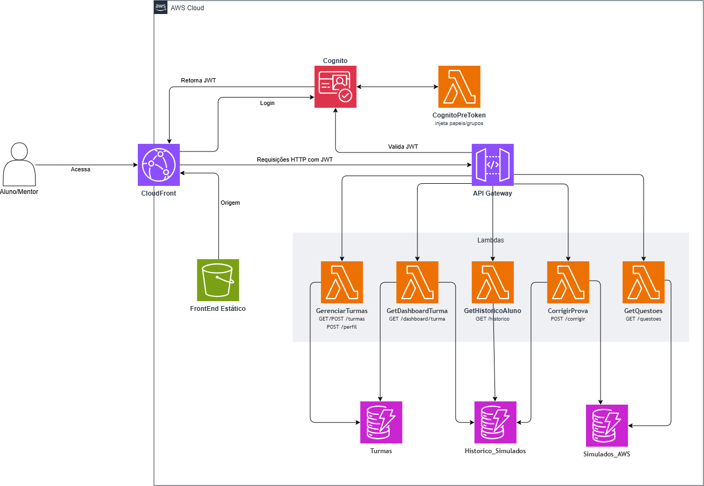

# Plataforma Serverless de Simulados AWS ☁️

**Status:** Concluído ✅

Uma plataforma educacional completa, rodando 100% de forma Serverless na infraestrutura da AWS. O sistema permite que estudantes simulem exames de certificações AWS reais e acompanhem seu progresso, enquanto mentores podem criar turmas, convidar alunos e acompanhar a evolução analítica de cada um através de um painel de controle.

---

## 🎯 Principais Funcionalidades

### Para Alunos 🧑‍🎓
- **Simulados Dinâmicos:** As questões são embaralhadas e validadas diretamente no banco de dados.
- **Histórico e Evolução:** Todos os simulados realizados ficam gravados na nuvem, acessíveis de qualquer dispositivo através da página de Evolução.
- **Turmas de Mentoria:** Possibilidade de usar códigos de convite para ingressar em turmas de mentores.
- **Anti-Repetição Inteligente:** O algoritmo evita que questões respondidas nos últimos simulados caiam no próximo.

### Para Mentores 👨‍🏫
- **Gerenciamento de Turmas:** Crie turmas e gere códigos de convite instantâneos.
- **Dashboard Analítico:** Visualize a média de pontuação, total de simulados feitos e identifique os domínios/tópicos onde a turma ou alunos individuais estão com pior desempenho.

---

## 🏗️ Arquitetura (AWS Serverless)

Toda a fundação cloud do projeto foi provisionada e é gerenciada via **Terraform (IaC)**, utilizando as melhores práticas de esteira CI/CD via GitHub Actions.

Para visualizar o diagrama de arquitetura em detalhes:

- **Frontend:** React + Vite, hospedado via estática no Amazon S3 com distribuição por CDN via Amazon CloudFront.
- **Autenticação:** Amazon Cognito (User Pool). Uma Lambda de *Pre Token Generation* intercepta o login e injeta o perfil (Aluno/Mentor) no JWT.
- **API & Roteamento:** Amazon API Gateway protegido nativamente pelo Cognito Authorizer.
- **Computação:** 5 Funções AWS Lambda independentes (Python 3.12) para tratar as rotas de correção de prova, listagem de turmas, histórico, dashboard, etc.
- **Banco de Dados:** Amazon DynamoDB (Pay-per-request). Foram desenhadas três tabelas NoSQL independentes (`Simulados_AWS`, `Turmas`, `Historico_Simulados`) contendo índices otimizados para busca reversa e relacionamento.

---

